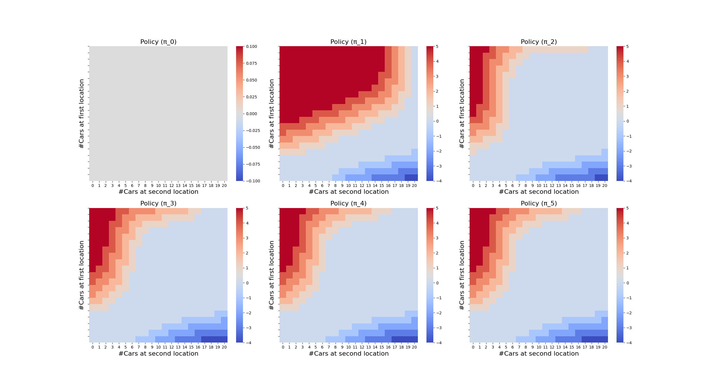
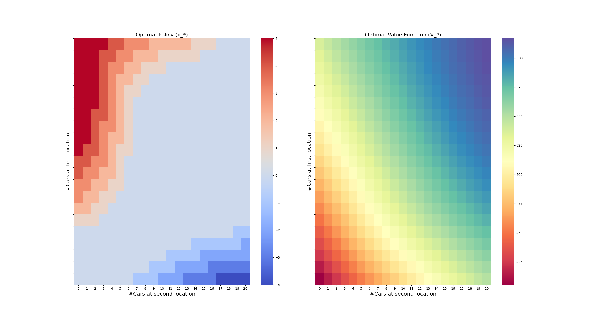
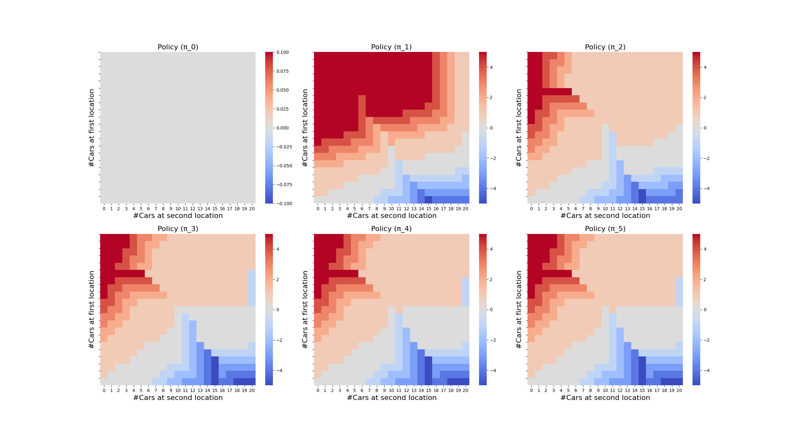
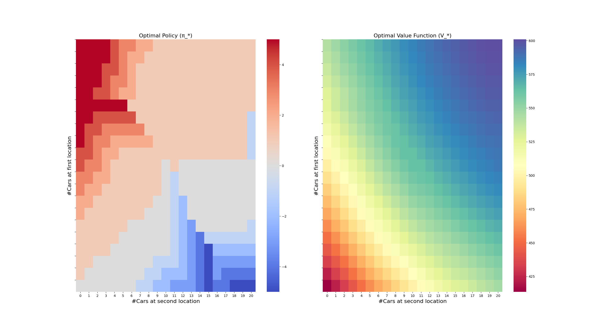

## Policy Iteration Algorithm to Estimate Optimal Policy and Optimal Value Function

In reinforcement learning (RL), sequential learning and decision making capability for an RL agent is formalized by defining a finite Markov Decision Process (MDP). Here, finite refers to the set of states, actions, rewards and probabilities of the environment all being finite in number. Using a finite MDP, a structure to solve the RL problem is brought in by defining returns, value functions, policies and Bellman equations. Importantly, a policy (π) maps the states of a finite MDP to the probabilities of selecting possible actions defined per state. In simple terms, a policy tells the RL agent to choose the best action in a current state that maximizes the expected return. This leads to finding an optimal policy for an RL problem formulated as a finite MDP. Policy iteration algorithm is an iterative reinforcement learning algorithm for estimating an optimal policy, π_* and its corresponding optimal value function -- state-value, V_* or action-value, q_*.

Below, two examples of a car rental management real-world problem are chosen. The requirements form the conditions/clauses that define the two examples. By formulating the problem as a finite MDP, the RL agent is endorsed with the task of managing car rental at two locations by using policy iteration algorithm.

### Sequence of Monotonically Improving Policies (Example-1)

### Estimated Optimal Policy and Optimal Value Function (Example-1)

### Sequence of Monotonically Improving Policies (Example-2)

### Estimated Optimal Policy and Optimal Value Function (Example-2)

### References

[1] Seaborn - Statistical Data Visualization: https://seaborn.pydata.org

[2] scipy.stats.poisson: https://docs.scipy.org/doc/scipy/reference/generated/scipy.stats.poisson.html

[3] NumPy - Fundamental Package for Scientific Computing in Python: https://numpy.org

[4] Matplotlib - Visualization with Python: https://matplotlib.org

[5] Markov Decision Process (MDP): https://en.wikipedia.org/wiki/Markov_decision_process

## Citation

Please note that the code and technical details made available are for educational purposes only. The repo is not open for collaboration.

If you happen to use the code from this repo, please cite my user name along with link to my profile: https://github.com/balarcode. Thank you!
