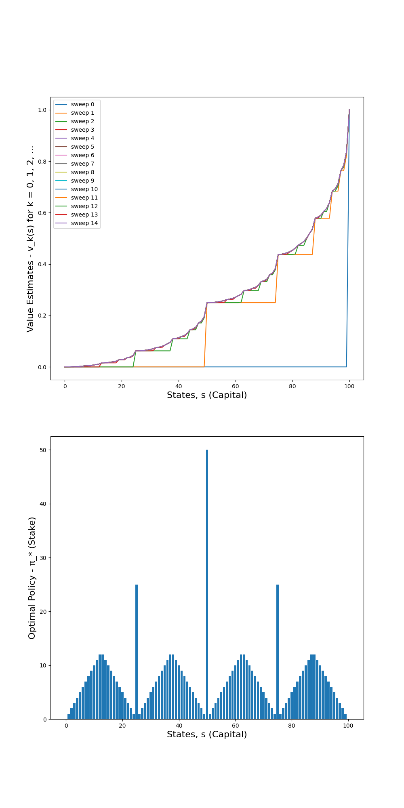
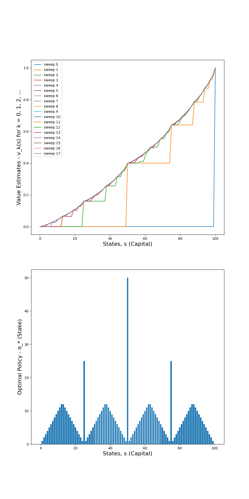
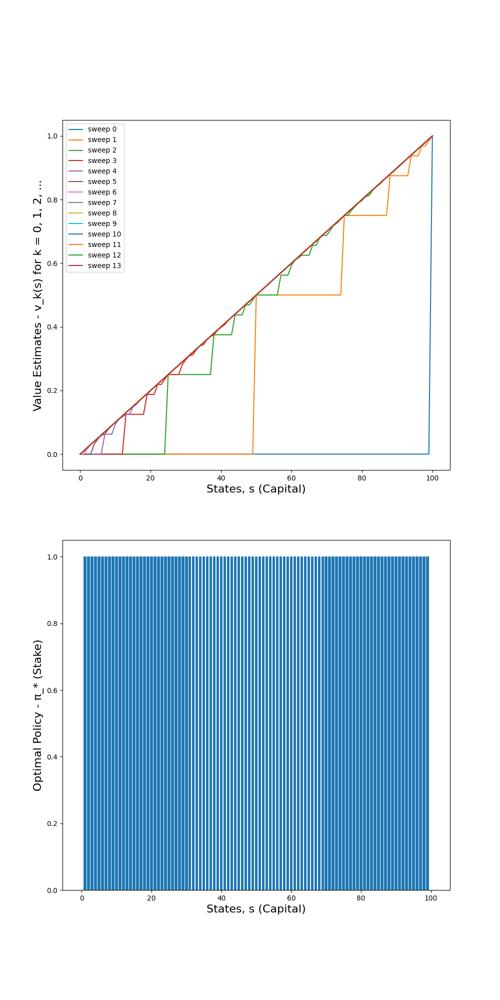
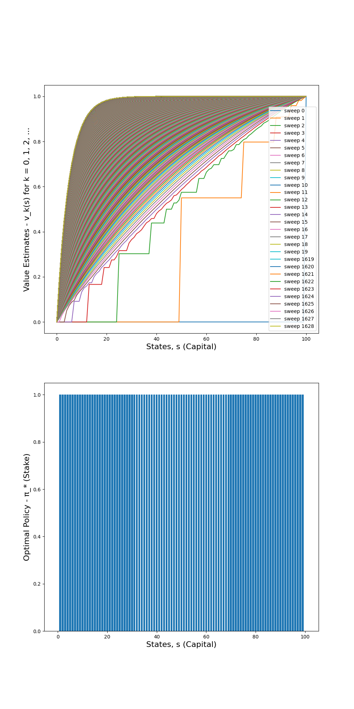
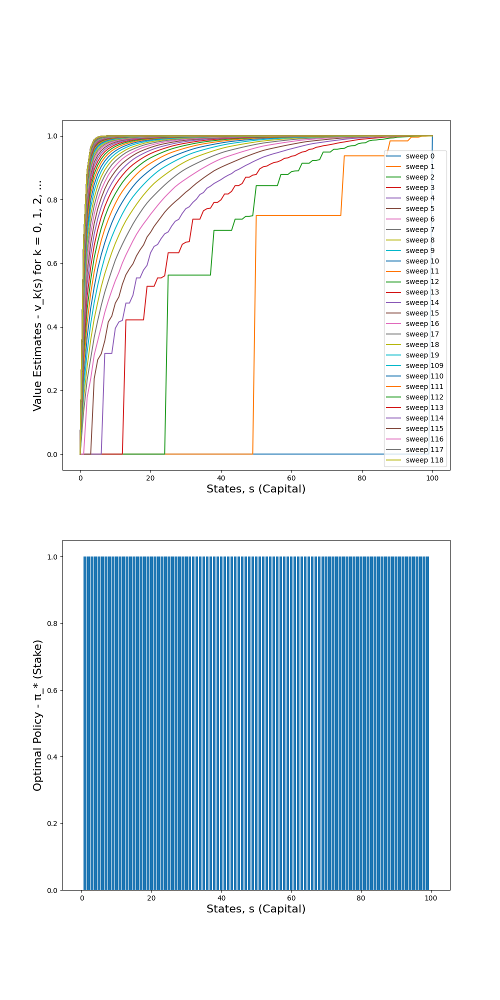

## Value Iteration Algorithm to Estimate Optimal Policy and Optimal Value Function

When the policy evaluation algorithm within policy iteration algorithm is truncated to only one sweep across the entire state space, it gives rise to value iteration algorithm. Value iteration algorithm combines truncated policy evaluation and policy improvement algorithms. Note that the policy improvement algorithm performs greedification of the policy, π with respect to the current value function, v_π(s). The truncation for policy evaluation can be achieved by choosing the maximum of the value functions estimated for all actions per state. Under the same conditions for a finite MDP, both multi-sweep and single-sweep policy evaluation algorithms eventually converge to the optimal value function, v* with the latter providing an advantage in terms of computational complexity and processing power required for convergence.

There are two approaches that can be taken to implement value iteration algorithm. First approach is to estimate optimal value function (v*) using iterative truncated policy evaluation algorithm followed by estimating optimal policy (π*) using policy improvement algorithm. Second approach is to perform local expected updates to both policy (π) and value function (v_k(s), k = 0, 1, 2, ...) in one iteration by alternating between local policy improvement algorithm and local truncated policy evaluation algorithm. The implemented code uses the second approach to implement value iteration algorithm.

An example of a gambler's problem is chosen to illustrate value iteration algorithm. In this problem, the finite MDP consists of gambler's capital money in dollars as states, s ε {1, 2, ..., 99}, staked or gambled money in dollars as actions, a ε {0, 1, ..., min(s, 100-s)} and reward being zero on all state transitions except when the gambler reaches the goal of $100 for a reward of +1. The state-value function, v_π(s) should give the probability of winning from each state. The policy will map from states (i.e. the levels of capital) to actions (i.e. levels of stakes). A coin flip is carried out to make bets with coin coming up as heads leading to winning as many dollars as the gambler had staked for and with coin coming up as tails leading to losing the stake. The terminal states include 0 (i.e. losing all the capital) and 100 (i.e. reaching the goal of $100).

Note that v* and v_* notations are used interchangeably. Similarly, π* and π_* notations are used interchangeably. 

### Value Estimates and Optimal Policy for Probability = 0.25

Value function estimates for one sweep across the entire state space is shown in the first figure below. The envelope of the value function estimates across all the sweeps provides the optimal value function (v*) for the finite MDP. The corresponding optimal policy (π*) is shown in the second figure below. A probability of heads occuring in a coin flip experiment is set to 0.25.

### Value Estimates and Optimal Policy for Probability = 0.4

Value function estimates for one sweep across the entire state space is shown in the first figure below. The envelope of the value function estimates across all the sweeps provides the optimal value function (v*) for the finite MDP. The corresponding optimal policy (π*) is shown in the second figure below. A probability of heads occuring in a coin flip experiment is set to 0.4.

### Value Estimates and Optimal Policy for Probability = 0.5

Value function estimates for one sweep across the entire state space is shown in the first figure below. The envelope of the value function estimates across all the sweeps provides the optimal value function (v*) for the finite MDP. The corresponding optimal policy (π*) is shown in the second figure below. A probability of heads occuring in a coin flip experiment is set to 0.5.

### Value Estimates and Optimal Policy for Probability = 0.55

Value function estimates for one sweep across the entire state space is shown in the first figure below. The envelope of the value function estimates across all the sweeps provides the optimal value function (v*) for the finite MDP. The corresponding optimal policy (π*) is shown in the second figure below. A probability of heads occuring in a coin flip experiment is set to 0.55.

### Value Estimates and Optimal Policy for Probability = 0.75

Value function estimates for one sweep across the entire state space is shown in the first figure below. The envelope of the value function estimates across all the sweeps provides the optimal value function (v*) for the finite MDP. The corresponding optimal policy (π*) is shown in the second figure below. A probability of heads occuring in a coin flip experiment is set to 0.75.

### References

[1] NumPy - Fundamental package for scientific computing in Python: https://numpy.org

## Citation

Please note that the code and technical details made available are for educational purposes only. The repo is not open for collaboration.

If you happen to use the code from this repo, please cite my user name along with link to my profile: https://github.com/balarcode. Thank you!
